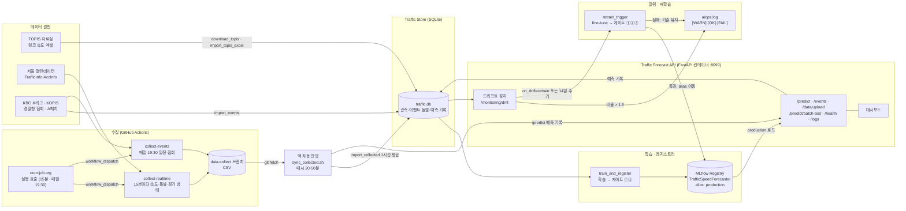
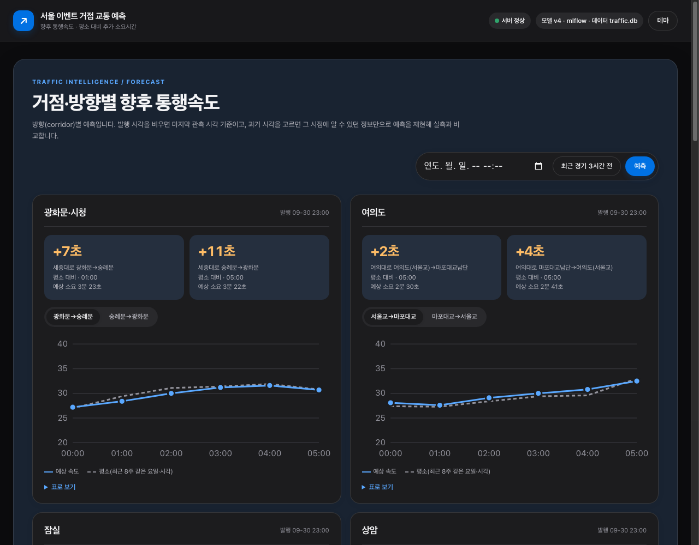
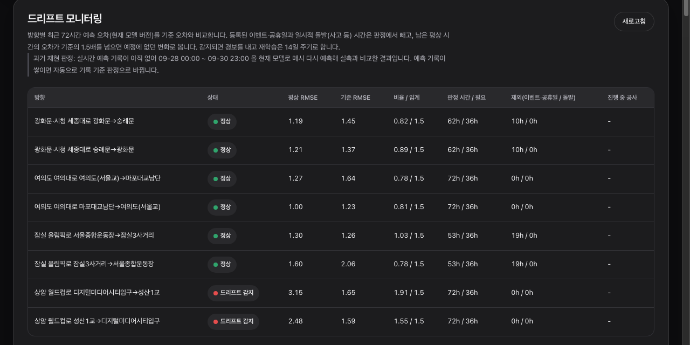

# 이벤트 인지형 서울 주요 거점 교통 예측 · 드리프트 대응 서비스

> 조별 미니 프로젝트 기획서 · 모델 서빙 및 AIOps 구성 · 2026-10-02 발표
> 저장소: `SKALA-SAJO/event-aware-traffic-seoul` (main) · 모든 수치는 실데이터(TOPIS 2023-01 ~ 2026-09) 기준

**한 줄 요약**: 경기·집회처럼 **미리 공개되는 일정**을 "알려진 미래 정보"로 넣어, 서울 이벤트 거점 도로의
**방향별 향후 6시간 통행속도와 평소 대비 추가 소요시간**을 예측하고, 운영 중에는 **예고된 이벤트와 예정에 없던 변화를
구분**해 후자만 드리프트로 다룹니다.

흐름: **왜**(① Pain Point) → **무엇을**(② 솔루션·운영 목표) → **어떻게 지킬 것인가**(③ 운영 설계) →
**어떻게 구현했나**(④ 아키텍처 · ⑤ API) → **결과**(⑥ 동작 화면)

---

## ① 이해관계자 가치 (Pain Point)

### 도메인 매핑 (HAIC 템플릿 → 우리 서비스)

| 템플릿 개념 (HAIC) | 예시: 프랜차이즈 수요 예측 | 우리 팀: 이벤트 인지형 거점 교통 예측 |
|---|---|---|
| 예측 대상: 다음날 종가 | 다음날 매장별 판매량 | **거점 도로 방향별 향후 1~6시간 통행속도** (→ 소요시간, 평소 대비 추가 시간). 8개 구간 = 광화문·시청 / 여의도 / 잠실 / 상암 × 상행·하행 |
| 입력 시퀀스: 최근 20거래일 (close, volume) | 최근 28일 (판매량, 프로모션 여부) | **최근 24시간** (구간 속도, 요일·시각·공휴일, 이벤트 강도) + 예측 대상 6시간의 **미리 알려진 정보** (요일·시각·공휴일, 공개된 경기·집회 일정) |
| 데이터 공급: 대시보드 CSV 업로드 | POS 일마감 데이터 업로드 | TOPIS 월별 속도 엑셀(자동 다운로드), 서울 실시간 속도·돌발과 당일 경기 상태(cron-job.org 가 15분마다 GitHub Actions 수집을 호출 → 맥이 매시 DB 반영), 경기·공연 일정과 경찰청 집회(매일 19:30) 수집 + 대시보드 CSV 업로드(`/data/upload`)·일정 등록(`/events`) |
| 배포 게이트: RMSE ≤ $4.00 | MAPE ≤ 15% (발주 오차 허용 범위) | ① 평상 시간 RMSE ≤ 단순 예측법(지난주 같은 시각, 현재 **2.13 km/h**) ② 이벤트 시간 RMSE < 이벤트 정보 없는 모델 ③ 재학습 시 기존 Production 보다 나쁘지 않음 |
| 드리프트 신호: 변동성 3배 급변 | 신메뉴 출시, 휴가철, 경쟁점 오픈 | 이벤트·공휴일·사고 시간을 뺀 **평상 시간 72시간 RMSE 가 기준의 1.5배 초과**. 예: 도로 공사·차로 축소, 신호 체계 변경, 원인 미상 정체. **예고된 집회·경기는 드리프트가 아님** |
| 재학습: 최근 21거래일 fine-tuning | 최근 4주 데이터로 fine-tuning | **최근 14일 fine-tuning** (최근일수록 가중, 반감기 3일). 운영 정책은 **14일 주기** 재학습, 드리프트는 경보 (실험 ③ 근거) |
| 알림: aiops.log [WARN] | 본사 SCM 담당자 메신저 알림 | `aiops.log` `[WARN] drift detected` (진행 중 공사가 있으면 원인 표시) + 대시보드 "드리프트 감지". 대상: 교통상황실 운영자 (메신저 연동은 다음 과제) |
| 이해관계자: 투자 분석가, 운영자 | 점주(재고 폐기), 본사 SCM(발주) | 교통 운영자(교통상황실·경찰: 통제·우회 배치), 시민·운전자(출발 시각·경로), 행사 주최·경기장(셔틀·귀가 안내), 모빌리티·배차 플랫폼(ETA), 서비스 운영자(모델 운영) |

### 문제
평소 패턴을 학습한 내비게이션·예측은 **경기 종료 후 귀가 정체, 도심 집회·행진**처럼 "예정돼 있지만 드문" 상황을
놓칩니다. 이런 정체는 한 방향에 몰리고(경기장 → 귀가 방향), 평소와 차이가 큽니다.

| 근거 (실데이터) | 내용 |
|---|---|
| 집회와 극단적 정체 | 광화문 세종대로 18시 속도가 가장 낮았던 30일 중 **28일이 신고 1천 명 이상 집회일** (2020~2026, 팀 검증) |
| 경기 종료 후 정체 | 2026-09-05 상암: K리그 + 인근 축제 종료 후 21시 DMC→합정 방향 **평소 31 → 실측 17.6 km/h** |
| 방향 차이 | 양방향을 평균하면 이벤트 시간 오차가 **2.09**, 방향별로 나누면 **1.59** (실험 ④) - 평균은 신호를 희석 |

### 이해관계자와 장애 영향 (도메인 매핑)

| 이해관계자 | 불편함 (Pain Point) | 중요성 | 서비스 장애 시 | 응답 지연 시 | 모델 품질 저하 시 |
|---|---|---|---|---|---|
| **교통 운영자** (서울시 교통상황실·경찰 교통관리) | 집회·경기 일정은 알지만 "몇 시에 어느 방향이 얼마나 막힐지"를 미리 알기 어려움 | 통제 인력·신호 운영·우회 안내를 사전에 배치해야 함 | 사전 배치 근거 상실 → 사후 대응 | 매시 발행 주기를 놓치면 배치 시점 지연 | 과소 예측 시 인력 부족, 과대 예측 시 과잉 통제 |
| **시민·운전자** | 귀가·출근길이 행사로 막히는지 모름 | 출발 시각·경로 선택 | 안내 중단 | 실시간성 저하 | 잘못된 소요시간 안내로 신뢰 하락 |
| **행사 주최·경기장** | 관객 귀가 동선 혼잡 예측이 없음 | 셔틀·귀가 안내 시점 결정 | 안내 계획 수립 불가 | - | 셔틀 배차 시점 오판 |
| **모빌리티·배차 플랫폼** | 행사 시간대 ETA 오차, 배차 페널티 | 도착 시간 약속 | ETA 보정 불가 | API 응답 지연이 앱 화면 지연으로 직결 | ETA 오차 증가 |

**핵심 요구**: 이벤트 시간대 예측이 평소 패턴보다 정확해야 하고(품질), 매시 제때 발행돼야 하며(응답·가용성),
도로 사정이 바뀌어 모델이 낡으면 **알아채야** 합니다(드리프트 대응).

---

## ② AI 솔루션과 운영 목표

### 핵심 기능

| 기능 | 내용 |
|---|---|
| 방향별 6시간 예보 | 8개 구간(광화문·시청 / 여의도 / 잠실 / 상암 × 상행·하행), 매시 발행, 향후 1~6시간 통행속도 → 소요시간 → **평소 대비 추가 시간** |
| 이벤트 인지 | KBO·K리그 경기, 상암 A매치, 경찰청 집회(신고 1천 명 이상)를 **공개 시각 이후에만** 입력으로 반영 |
| 과거 시점 재현 | 임의 발행 시각을 골라 "그때 알 수 있던 정보만으로" 예측을 재현하고 실측과 비교 |
| 드리프트 감지 | 예고된 이벤트·공휴일·일시적 사고 시간은 빼고, 남은 평상 시간의 오차가 기준의 1.5배를 넘으면 경보 |
| 일정 관리 | 대시보드·API로 이벤트 등록·취소(취소 공지 시각 기록)·검토 대기 확정 |

### 서빙되는 모델의 역할
- **모델**: 2-입력 LSTM. 과거 24시간 [속도, 요일·시각·공휴일, 이벤트 강도] +
  예측 대상 6시간의 [요일·시각·공휴일, 이벤트 강도, 구간] → 6시간 속도
- **학습 데이터**: TOPIS 링크별 통행속도 45개월(2023-01 ~ 2026-09, 링크 34개 → 구간 8개),
  이벤트(경기 740, A매치 10, 집회 1,843). 공연(KOPIS)·문화행사·통제 공지는 실험에서 효과가 없어 **표시·드리프트 제외에만** 사용
- **교통량 제외 (2026-10-02, `train.use_volume: false`)**: 연결된 측정 지점이 광화문 A-17 하나뿐이고 2026-01~07 값이 비어 있으며
  실시간으로 수집하지 않아 운영에서는 항상 결측 → 학습·운영 조건이 달랐음. 효과도 시드 1개 실험에서 잡음 수준(실험 ①).
  현재 Production 은 제외 전에 학습한 버전이라 다음 재학습부터 반영됨
- **역할**: 이벤트 시간대에 평소 패턴(단순 예측)과 "이벤트 정보 없는 모델"보다 정확한 예측을 제공

### 운영 목표 (요구사항)

| 구분 | 목표 | 현재 측정값 (로컬, M5) |
|---|---|---|
| **응답 시간** | `/predict` 1초 이내 | 1개 구간 **37 ms**(중앙값), 8개 구간 전체 **270 ms**, `/monitoring/drift` 40 ms |
| **가용성** | 컨테이너 헬스체크 정상, 모델 사전 로드(eager)로 첫 요청 지연 제거 | `/health` 200. 서버 시작(health OK): lazy **0.39s** / eager **2.92s**, 첫 `/predict`: lazy **10.39s** → eager **0.13s** (2026-10-02) |
| **품질 ① 평상** | 평상 시간 RMSE ≤ 단순 예측법(지난주 같은 시각) | **1.57** km/h ≤ 2.13 |
| **품질 ② 이벤트** | 이벤트 시간 RMSE < 이벤트 정보 없는 모델 | **1.89** < 1.94 (잠실 하행 1.57 → 1.40, 여의도 하행 2.07 → 1.78) |
| **사용자 지표** | 소요시간 오차 | 약 2km 구간 기준 평균 약 20초 |
| **신선도** | 실측 수집 15분 간격(시간당 최대 4회), 시간 평균으로 반영 | 수집 동작 중. GitHub 예약 실행은 자주 늦거나 빠져(10-02 01~08시 공백) cron-job.org 가 실행을 호출하도록 바꿈 → 10-02 08:50부터 안정(30분 간격으로 시작, 저장소 공개 후 15분). DB 반영은 맥이 매시 20·50분 자동. "지금부터 6시간" 예측은 연속 24시간이 쌓인 뒤(10-03 08시경) 시작하고, 그 전에는 마지막 TOPIS 관측(09-30 23시) 기준 |

품질 목표의 근거가 된 실험(`reports/experiments/summary.md`):

| 실험 | 결론 |
|---|---|
| ① 피처 단계 | 속도 → +교통량 → +캘린더 → +이벤트. 캘린더(이벤트 RMSE 1.852 → 1.649)·이벤트(→ 1.592) 단계에서 개선. 교통량 단계(1.913 → 1.852, 시드 1개)는 지점이 광화문 2개 구간뿐인데 지점 없는 구간도 같은 크기로 흔들려 잡음 수준 → 입력에서 제외 |
| ② 이벤트 표현 | 규모 × 시간 감쇠 채택 (이벤트 RMSE 1.863, 정보 없음 1.935) |
| ④ 예측 단위 | 방향별이 거점 평균보다 이벤트 시간 오차 약 24% 낮음 |
| ⑤ 이벤트 출처 | KOPIS 공연·문화행사는 넣으면 나빠짐 → 피처 제외 (시드 3개) |
| ⑥ 데이터 확장 | 집회 + 과거 2년 + A매치 채택: 1.747 → **1.704** (시드 3개, 광화문·여의도 4~7% 개선) |

---

## ③ 운영 설계

### 1. 배포 게이트

| 단계 | 기준 | 임계값 / 동작 | 근거 |
|---|---|---|---|
| **입력 스키마 검증** | 요청 본문 Pydantic 검증 | 형식 오류·범위 위반은 **422** (예: `speed` 0 초과 150 이하, `issued_at` 날짜 형식) | 잘못된 입력이 모델·DB에 들어가지 않게 |
| | 업로드 CSV 검증 | 필수 열(`corridor`, `datetime`/`ts`, `speed`), 등록된 구간인지, 시각 해석 가능 여부 → **400** | 설정에 없는 구간·깨진 시각 차단 |
| | 도메인 검증 | 학습하지 않은 구간 **404**, 직전 24시간 관측 부족 **409** | 모델이 답할 수 없는 요청을 명확히 거절 |
| **성능 회귀 ①** | 평상 시간 RMSE ≤ 기준값 | 기준 = 같은 평가 구간 단순 예측법(지난주 같은 시각) RMSE (현재 2.13) | 가장 단순한 방법보다 못하면 배포할 이유가 없음 |
| **성능 회귀 ②** | 이벤트 시간 RMSE < 이벤트 정보 없는 모델 | 이벤트 시간 24시간 미만이면 건너뜀 | "이벤트 인지"가 실제로 도움이 되는지 |
| **성능 회귀 ③** (재학습 시) | 새 모델 ≤ 현재 Production | 최근 1일 평가 | 재학습이 기존보다 나빠지는 것을 차단 |
| **승격** | 모두 통과 시 MLflow alias `production` 이동 + 서빙 캐시 갱신 | 실패 시 기존 버전 유지 | 롤백 = alias 를 이전 버전으로 되돌림 |

### 2. 모니터링 지표와 임계값

| 지표 | 계산 | 임계값 | 조치 |
|---|---|---|---|
| **드리프트 비율** | 구간별 최근 72시간 평상 시간 RMSE ÷ 기준 RMSE(검증 구간) | **> 1.5** | `[WARN] drift detected` (진행 중 공사가 있으면 원인 표시) |
| 판정 가능 시간 | 이벤트·공휴일·사고 제외 후 남은 시간 | **≥ 36시간** | 미만이면 "판정 대기" (사유 표시) |
| 예고된 이벤트 시간 오차 | 이벤트·공휴일 시간의 RMSE | 판정에서 제외, 크면 `[INFO]` 기록 | 이벤트 피처 개선 검토 |
| 응답 시간 | `/predict` 처리 시간 | 1초 | 초과 시 조사 |
| 헬스 | `/health` 모델 로드·마지막 관측 시각 | 모델 미로드, 관측이 2시간 이상 지연 | 서빙·수집 점검 |
| 수집 | Actions 실행 결과, cron-job.org 호출 기록 | 서울 API 무응답(첫 호출 8초 초과) 또는 모든 링크 실패 시 그 회차 실패 | 다음 회차(15분 뒤)가 자동 재시도. 연속 실패면 키·접속 점검. 호출 자체가 실패(204 아님)하면 토큰·cron-job.org 점검 |

**판정에서 제외하는 시간 (오경보 방지)**: 등록된 이벤트(경기·공연·집회·통제)의 시작 3시간 전 ~ 종료 3시간 후,
공휴일, 일시적 돌발(사고·고장·통제, 서울시 `AccInfo`). **공사**처럼 지속되는 변화는 제외하지 않고 원인으로 표시합니다.

### 3. 드리프트 대응 정책

```
드리프트 감지 → [WARN] 알림(aiops.log·대시보드) → 재학습(최근 14일 fine-tuning, 최근일수록 가중)
  → 게이트 ①②③ 재검증 → 통과: production alias 이동 [OK]  /  실패: 기존 버전 유지 [FAIL]
```

| 설정 (`config/hubs.yaml`) | 값 | 근거 |
|---|---|---|
| `retrain.on_drift` | **`alert`** (운영) / `retrain` (시연) | 실험 ③(75일 walk-forward): 감지 즉시 재학습은 원인 모를 일시 정체에 맞춰져 평상 RMSE 악화(1.73) → **14일 주기 재학습(1.67)이 가장 좋음**. 임계 2.0 으로 올려도 같음 |
| `retrain.period_days` | 14 | `train_and_register.py --fine-tune` 을 주기 실행 |
| `drift.rmse_ratio_threshold` | 1.5 | 정상 시나리오 비율 1.02~1.22, 공사 주입 2.46 → 오경보 없이 분리 |
| `drift.window_hours` / `min_samples` | 72 / 36 | 하루 주기 패턴 3번, 이벤트 제외 후에도 하루 반 이상 확보 |

**운영 중 발견한 개선점**: 재학습 시 게이트 ①은 처음 학습 때 정한 고정 기준(2.13)을 씁니다. 도로 사정이 실제로 바뀐
경우(시연: 공사 주입) 새 모델이 기존보다 크게 나아도(3.98 → 2.40) 고정 기준을 넘어 승격되지 않았습니다.
**재학습 평가 구간에서 단순 예측법 기준을 다시 계산**하도록 바꾸는 것이 다음 과제입니다.

---

## ④ 아키텍처 구성도



| 구성요소 | 구현 | 역할 |
|---|---|---|
| 데이터 업로드 | `scripts/import_*.py`, `POST /data/upload`, `POST /events(/upload)` | 원천 → 구간 단위(거리 가중 조화평균) 관측·이벤트 |
| 실시간 수집 | cron-job.org → `.github/workflows/collect_realtime.yml`, `collect_events.yml` → `data-collect` 브랜치 | 15분 스냅숏(속도·돌발) + 당일 경기 상태(우천취소), 매일 일정·경찰청 집회(`collect_rallies.py`). GitHub 예약 실행이 불안정해 외부 스케줄러가 실행을 호출 |
| DB 자동 반영 | `scripts/sync_collected.sh` (macOS launchd, 매시 20·50분) → `scripts/import_collected.py` → `/predict` | 1시간 평균으로 DB 반영(처음엔 최근 24시간이 찬 뒤), 일정은 처음 보인 시각을 공개 시각으로, 예측 기록 저장 |
| 학습·레지스트리 | `serving_app/train_and_register.py`, MLflow(sqlite) | 학습 → 게이트 → 등록 → alias `production` |
| 서빙 | `serving_app/main.py` (FastAPI), `serving_app/Dockerfile` (포트 8099) | Production 모델 로드, 예측·이벤트·데이터 API, 대시보드 |
| 예측 기록·로그 | `predictions` 테이블, `logs/aiops.log` | 드리프트 판정 재료, 운영 이력 |
| 드리프트 감지 | `serving_app/monitoring/drift_detector.py` | 이벤트·공휴일·사고 제외 후 비율 판정. 예측 기록이 없으면 과거 재현 판정 |
| 알림·재학습 | `serving_app/monitoring/retrain_trigger.py` | `[WARN]` → fine-tune → 게이트 → `[OK]`/`[FAIL]` |

---

## ⑤ API 명세

Swagger UI: `http://localhost:8077/docs` (로컬) / `http://localhost:8099/docs` (컨테이너)

| Method | URL | 설명 | 주요 응답 |
|---|---|---|---|
| POST | `/predict` | 거점·구간별 향후 6시간 예측 (발행 시각 지정 시 과거 재현) | 200, 404, 409, 422 |
| POST | `/predict/batch-test` | 관측치 주입 → 슬라이딩 예측 → 드리프트 판정 → (재학습) | 200, 404, 409, 422 |
| GET | `/health` | 서버·모델 버전·마지막 관측 시각 | 200 |
| GET | `/hubs` | 거점·구간 목록 | 200 |
| POST | `/data/upload` | 구간 관측 CSV 업로드 | 200, 400, 422 |
| GET | `/data/status` | 구간별 적재 현황 | 200 |
| POST / GET | `/events` | 이벤트 등록(행진·통제 추출) / 조회(`?status=review` 등) | 200, 422 |
| POST | `/events/upload` | 이벤트 CSV 일괄 등록 | 200, 422 |
| PATCH | `/events/{id}/status` | 검토 확정 / 취소(공지 시각 기록) | 200, 404, 422 |
| DELETE | `/events/{id}` | 이벤트 삭제 | 200, 404 |
| GET | `/monitoring/drift` | 구간별 드리프트 판정 | 200 |
| GET | `/incidents` | 돌발 정보 | 200, 422 |
| GET | `/logs`, `/logs/{filename}` | aiops 로그 목록·내용 | 200, 422 |

### POST `/predict` (추론)
```json
// Request
{ "corridor": "jamsil_down", "issued_at": "2026-09-30 16:00:00", "log": false }
```
```json
// Response 200 (forecast 6개 중 2개만 표시)
{ "forecasts": [ {
  "corridor": "jamsil_down", "corridor_name": "올림픽로 잠실3사거리→서울종합운동장",
  "hub": "jamsil", "name": "잠실", "issued_at": "2026-09-30 16:00:00",
  "segment_length_km": 1.956, "model_version": "v4",
  "forecast": [
    { "target_ts": "2026-09-30 17:00:00", "horizon": 1, "speed_kmh": 21.4, "actual_speed_kmh": 21.4,
      "usual_speed_kmh": 22.4, "travel_time_min": 5.478, "usual_travel_time_min": 5.231,
      "extra_min": 0.247, "events": ["KBO NC vs 두산"] },
    { "target_ts": "2026-09-30 18:00:00", "horizon": 2, "speed_kmh": 22.2, "actual_speed_kmh": 23.0,
      "usual_speed_kmh": 23.6, "travel_time_min": 5.298, "usual_travel_time_min": 4.972,
      "extra_min": 0.326, "events": ["KBO NC vs 두산"] } ] } ] }
```
- `hub`·`corridor` 생략 시 8개 구간 전체, `issued_at` 생략 시 마지막 관측 시각, `log: true` 면 예측 기록 저장(드리프트 재료)
- `actual_speed_kmh` 는 과거 재현일 때만 채워짐

```json
// 422 - 입력 형식 오류
{ "detail": [ { "type": "datetime_from_date_parsing", "loc": ["body", "issued_at"],
  "msg": "Input should be a valid datetime or date, invalid character in year", "input": "not-a-date" } ] }
// 404 - 학습하지 않은 구간
{ "detail": "모델이 학습하지 않은 corridor 입니다: 없는구간 (학습 대상: ['gwanghwamun_up', ...])" }
// 409 - 직전 관측 부족
{ "detail": "jamsil_up: 2019-11-06 10:00:00 ~ 2020-01-01 16:00:00 구간의 관측치가 없습니다" }
```

### POST `/predict/batch-test` (배치 테스트 · 드리프트 주입)
```json
// Request
{ "corridor": "sangam_up",
  "observations": [ { "ts": "2026-10-01 00:00", "speed": 30.2, "volume": null }, "... 연속된 시간" ] }
```
```json
// Response 200 (요약 - points 값은 형식 예시, drift_check 는 ⑥-3 실제 실행 결과)
{ "corridor": "sangam_up", "model_version": "v4",
  "points": [ { "ts": "2026-10-01 01:00:00", "predicted": 34.1, "actual": 33.0, "known_event": false } ],
  "drift_check": { "status": "retrain_triggered", "drift": { "ratio": 2.46, "threshold": 1.5, "n_hours": 48 },
                   "promoted": false, "rmse_normal": 2.40, "production_rmse_normal": 3.98 } }
```
```json
// 422 - 범위 위반 (speed 는 0 초과)
{ "detail": [ { "type": "greater_than", "loc": ["body", "observations", 0, "speed"],
  "msg": "Input should be greater than 0", "input": -3, "ctx": { "gt": 0.0 } } ] }
```

### GET `/health` (헬스체크)
```json
{ "status": "ok", "model_loaded": true, "model_version": "v4", "loading_mode": "lazy",
  "model_source": "mlflow", "traffic_db": "data/traffic.db", "last_observation": "2026-09-30 23:00:00" }
```

### POST `/data/upload` (업로드, multipart CSV)
```
corridor,datetime,speed,volume
jamsil_up,2026-10-01 09:00,24.1,
```
```json
// 200
{ "filename": "obs.csv", "rows": 1, "corridors": ["jamsil_up"], "start": "2026-10-01 09:00:00", "end": "2026-10-01 09:00:00" }
// 400
{ "detail": "CSV에 corridor, datetime(또는 ts), speed 컬럼이 있어야 합니다 (volume 선택)." }
{ "detail": "config/hubs.yaml 에 없는 corridor: ['unknown_corridor']" }
```

### GET `/monitoring/drift` (드리프트 판정)
```json
[ { "corridor": "sangam_up", "hub": "sangam", "model_version": "v4", "mode": "replay",
    "window_start": "2026-09-28 00:00:00", "window_end": "2026-09-30 23:00:00",
    "status": "drift", "reason": null, "rmse": 3.15, "reference_rmse": 1.65, "ratio": 1.91, "threshold": 1.5,
    "n_hours": 72, "min_samples": 36, "excluded_hours": 0, "excluded_incident_hours": 0, "constructions": [] } ]
```
- `mode`: `logged`(예측 기록 기준) / `replay`(예측 기록이 없어 같은 기간을 다시 예측해 판정, DB 미저장·재학습 미사용)
- `status`: `ok` / `drift` / `insufficient_data`(+ `reason`: `no_predictions` 또는 `too_few_hours`)

### GET `/logs/aiops.log` (로그 조회)
```json
{ "name": "aiops.log", "content": "2026-10-01 23:07:59 [WARN] drift detected corridor=sangam_up ... - triggering retrain\n..." }
```

---

## ⑥ 동작 화면 스냅샷

### 1. 예측 대시보드 (방향별 향후 6시간)


거점마다 방향별 카드(평소 대비 가장 많이 늦어지는 시각의 추가 소요시간), 예측·평소·실측 그래프, 이벤트 영향 시간(음영).
발행 시각을 고르거나 **"최근 경기 3시간 전"** 을 누르면 그 시점에 공개된 정보만으로 예측을 재현해 실측과 비교합니다.

### 2. 드리프트 모니터링 (실데이터 과거 재현)


9/28 ~ 9/30 기준 6개 구간 **정상**(비율 0.78~1.03), 상암 2개 구간 **드리프트 감지**(1.91, 1.55).
원인: 9/28(월) 18~19시 상암 DMC→합정 방향이 예측 21.8 → **실측 11.7 km/h**, 등록된 이벤트 없음 - 예정에 없던 정체를 잡아냄.
잠실은 KBO 경기 19시간을 판정에서 제외(오경보 방지).

### 3. 드리프트 주입 → 알림 → 재학습 → 게이트 (실데이터 사본, `on_drift: retrain`)

```
$ python scripts/simulate_drift.py --corridor sangam_up --scenario normal
[normal] sangam_up 48h  model=v4  MAE normal=1.10
    drift_check: status=ok  ratio=1.02 (threshold 1.5)  kept=48h  excluded=0h

$ python scripts/simulate_drift.py --corridor sangam_up --scenario construction
[construction] 일정에 없는 도로 공사(차로 축소) 5일 주입
[construction] sangam_up 120h  model=v4  MAE normal=3.02  event=1.67
    drift_check: status=retrain_triggered  ratio=2.46 (threshold 1.5)  kept=48h  excluded=24h
    retrain: promoted=False new_version=None rmse_normal 3.98 -> 2.40
```
```
# logs/aiops.log
2026-10-01 23:07:59 [WARN] drift detected corridor=sangam_up rmse=4.04 ref=1.65 ratio=2.46 (excluded event/holiday 24h, incident 0h) - triggering retrain
2026-10-01 23:07:59 [INFO] retrain triggered (mode=fine-tune, window=last_14_days, parent=v4)
2026-10-01 23:08:03 [FAIL] gate failed ['gate1_normal'] - keep production v4
```
- **정상 → 판정 정상, 공사 → 감지 → 재학습 → 게이트 재검증 → 실패 시 기존 v4 유지**가 자동으로 동작
- 예고된 집회를 주입한 시나리오는 이벤트 시간 오차가 컸지만(4.33) 판정에서 제외돼 정상(오경보 없음)

### 4. 모델 버전 전환 전/후

| 시나리오 | 전 | 후 | 결과 |
|---|---|---|---|
| 실데이터 + 공사 주입 (위 3) | `/health` `model_version: v4` | `v4` (동일 요청의 예측값도 동일) | 게이트 ① 실패 → **기존 버전 유지** |
| 합성 데이터 + 공사 주입 (파이프라인 검증) | `v4` | **`v5`** | `[OK] new_rmse=2.91 (production was 3.97) - production promoted: TrafficSpeedForecaster v5` |
| 실데이터 base 학습 이력 | v1 (경기만, 2025~) → v2 → v3 (집회·과거 2년) → **v4** (2023~ 경기 일정 보강) | | 모두 게이트 ①② 통과 후 alias 이동 |

### 5. 컨테이너 실행
```
$ docker compose -f serving_app/docker-compose.yml up -d --build
$ docker compose -f serving_app/docker-compose.yml ps
NAME                        IMAGE                     STATUS       PORTS
serving_app-serving-app-1   serving_app-serving-app   Up 2 hours   0.0.0.0:8099->8099/tcp

$ curl localhost:8099/health
{"status":"ok","model_loaded":true,"model_version":"v1","loading_mode":"eager","model_source":"mlflow","last_observation":"2026-09-30 23:00:00"}
```
이미지 빌드 중 실데이터로 학습 → 게이트 통과 → Production 등록까지 끝낸 자기 완결형 이미지입니다
(`[GATE PASSED] normal_rmse=1.56 event_rmse=1.87`). 컨테이너는 자체 MLflow 레지스트리를 쓰므로 버전 번호가 v1 로 표시됩니다.

### 발표 시연 순서 (권장)
1. 대시보드 → "최근 경기 3시간 전" → 잠실 경기 전후 예측 vs 실측
2. 드리프트 모니터링 → 6개 정상 / 상암 드리프트 감지 (9/28 원인 미상 정체)
3. Swagger(`/docs`)에서 `/predict` 422 예시 → 입력 검증
4. (사본 서버) `simulate_drift.py` 공사 주입 → `/logs` 에서 `[WARN] → retrain → [FAIL] keep v4`
5. `docker compose ps`, `curl :8099/health`

---

## 한계와 다음 과제

| 구분 | 내용 |
|---|---|
| 운영 전환 | 드리프트 점검·알림의 주기 실행 (지금은 대시보드·`/monitoring/drift` 조회 시에만 판정). 완료: 매시 DB 반영·예측 기록(`sync_collected.sh`), 경찰청 집회 매일 수집 |
| 게이트 | 재학습 시 게이트 ① 기준을 평가 구간에서 다시 계산 (도로 사정 변화 시 개선 모델이 막히는 문제) |
| 모델 | 공연 피처 재설계(경기장 콘서트·공원 축제 구분), 경기별 규모 차이, 날씨, 집회 피처 세부 조정 |
| 검증 | 실시간 속도(15분 스냅숏 평균)와 TOPIS 시간 평균 일치 여부, 실험 ①③④⑤ 최종 설정·시드 3개 재실행 |
| 데이터 가정 | 과거 경기 공개 시각 = 경기 7일 전, 우천취소 공지 = 시작 2시간 전(10-02부터는 15분 수집에서 처음 '취소'로 보인 시각을 우선 사용), 규모 = 수용·신고 인원(관중 수 미사용) |
